# Laboratório de IaC com Terraform - AWS EC2

Atividade prática de Infraestrutura como Código usando Terraform e AWS, baseada no tutorial [Terraform Screenshots: Practical Examples](https://www.cloudbolt.io/terraform-best-practices/terraform-screenshots/), da CloudBolt.

O objetivo foi provisionar uma instância EC2 por código, validar o ciclo `init -> plan -> apply`, entender o papel do arquivo de estado e demonstrar a recuperação do gerenciamento com `terraform import`.

## Visão Geral

| Item | Decisão usada no laboratório |
| --- | --- |
| Cloud | AWS |
| Região | `us-east-1` |
| Recursos principais | EC2 `aws_instance.my_vm` e Security Group `aws_security_group.web` |
| Tipo da instância | `t3.micro` |
| AMI | Amazon Linux 2023 selecionada dinamicamente |
| Aplicação publicada | [modern-todomvc-vanillajs](https://github.com/1Marc/modern-todomvc-vanillajs) |
| Gerenciamento | Estado local do Terraform |
| Status final | EC2 e Security Group destruídos após as evidências para evitar custo |

O tutorial usa uma AMI fixa e `t2.micro`. Mantive a mesma ideia central, mas fiz dois ajustes: usei uma busca dinâmica da AMI para evitar ID obsoleto e troquei para `t3.micro`, que era o tipo elegível ao Free Tier nesta conta no momento da execução.

## Estrutura

```text
.
├── main.tf
├── outputs.tf
├── provider.tf
├── variables.tf
├── terraform.tfvars.example
├── docs
│   ├── evidence
│   └── images
├── scripts
│   └── render_terminal_screenshots.py
└── templates
    └── user_data.sh.tftpl
```

Os arquivos `.tfstate`, os planos locais e o cache `.terraform/` não entram no Git, porque carregam o estado local da execução e podem expor detalhes desnecessários da conta.

## Código Criado

O `provider.tf` define a AWS como provedor, a região por variável e tags padrão para todos os recursos. No `main.tf`, a AMI é buscada com `data "aws_ami"`, a instância EC2 é criada com tags claras e um Security Group libera HTTP na porta `80`.

A implantação da aplicação fica em `templates/user_data.sh.tftpl`: quando a EC2 inicializa, ela instala Nginx/Git, clona o repositório público da TodoMVC e copia os arquivos para o diretório padrão do Nginx.

```hcl
resource "aws_security_group" "web" {
  name_prefix = "${var.project_name}-web-"
  vpc_id      = data.aws_vpc.default.id

  ingress {
    description = "HTTP from the internet"
    from_port   = 80
    to_port     = 80
    protocol    = "tcp"
    cidr_blocks = ["0.0.0.0/0"]
  }
}

resource "aws_instance" "my_vm" {
  ami                         = coalesce(var.ami_id, data.aws_ami.amazon_linux.id)
  instance_type               = var.instance_type
  subnet_id                   = sort(data.aws_subnets.default.ids)[0]
  associate_public_ip_address = true
  vpc_security_group_ids      = [aws_security_group.web.id]
  user_data_replace_on_change = true
  user_data = templatefile("${path.module}/templates/user_data.sh.tftpl", {
    app_repo_url = var.app_repo_url
    app_repo_ref = var.app_repo_ref
  })

  tags = {
    Hello     = "World"
    Name      = var.instance_name
    Project   = var.project_name
    ManagedBy = "Terraform"
    Owner     = "Thiago Gomes"
  }
}
```

## Passo a Passo Executado

### 1. Conferência das ferramentas

Antes de provisionar, conferi a versão do Terraform e o perfil AWS usado na execução.

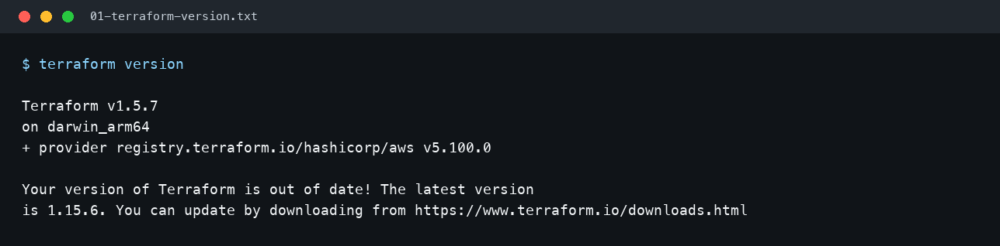

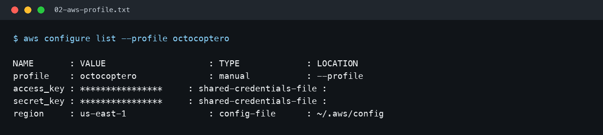

### 2. Formatação, inicialização e validação

Rodei `terraform fmt`, `terraform init` e `terraform validate`. O `init` baixou o provedor AWS e criou o arquivo de bloqueio do Terraform.

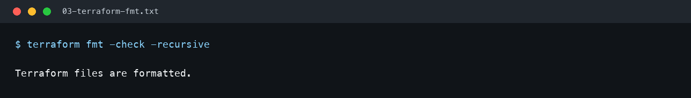

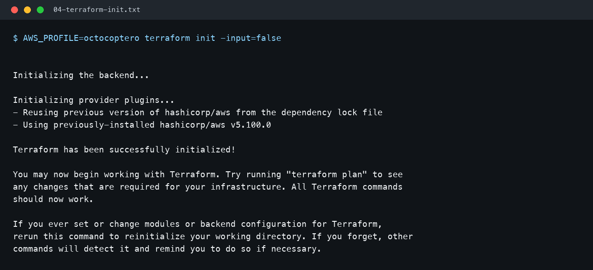

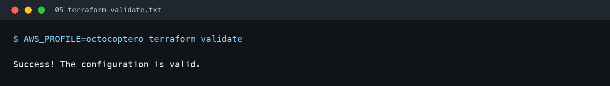

### 3. Planejamento da infraestrutura

O `terraform plan` mostrou exatamente o esperado para a primeira implantação: `1 to add, 0 to change, 0 to destroy`.

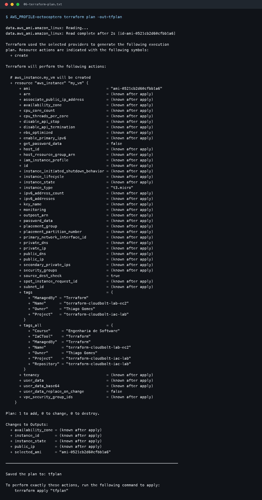

### 4. Criação da EC2

Com o plano aprovado, executei o `terraform apply`. A EC2 foi criada com sucesso e o Terraform retornou as saídas definidas no projeto.

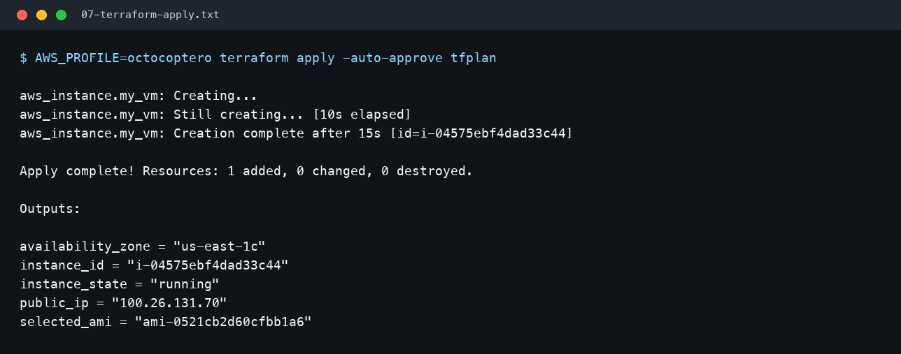

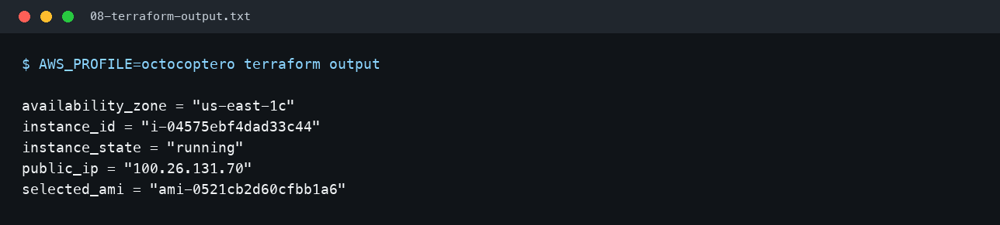

Também conferi o estado local para confirmar que o Terraform passou a conhecer a AMI consultada e a EC2 criada.

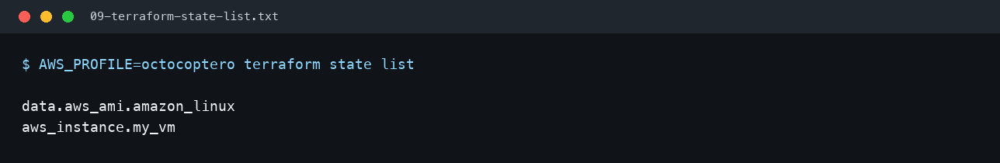

## Itens Provisionados na Nuvem

Na primeira execução, seguindo o tutorial original, o recurso principal provisionado foi uma EC2 em `us-east-1`, criada e gerenciada pelo bloco `aws_instance.my_vm`.

| Recurso provisionado | Identificação | Finalidade |
| --- | --- | --- |
| EC2 | `terraform-cloudbolt-lab-ec2` | Servidor simples para demonstrar provisionamento IaC |

A instância foi criada com AMI Amazon Linux 2023 selecionada automaticamente pelo Terraform e tags de rastreabilidade: `Project`, `ManagedBy`, `Owner` e `Hello`.

Evidência da instância criada na AWS:

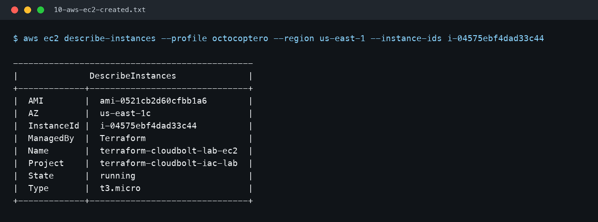

Na evolução da atividade, o Terraform passou a criar também um Security Group HTTP para publicar uma aplicação web real:

| Recurso provisionado | Identificação | Finalidade |
| --- | --- | --- |
| EC2 | `terraform-cloudbolt-lab-ec2` | Hospedar Nginx e servir a TodoMVC |
| Security Group | `terraform-cloudbolt-iac-lab-web-*` | Liberar acesso HTTP na porta `80` |

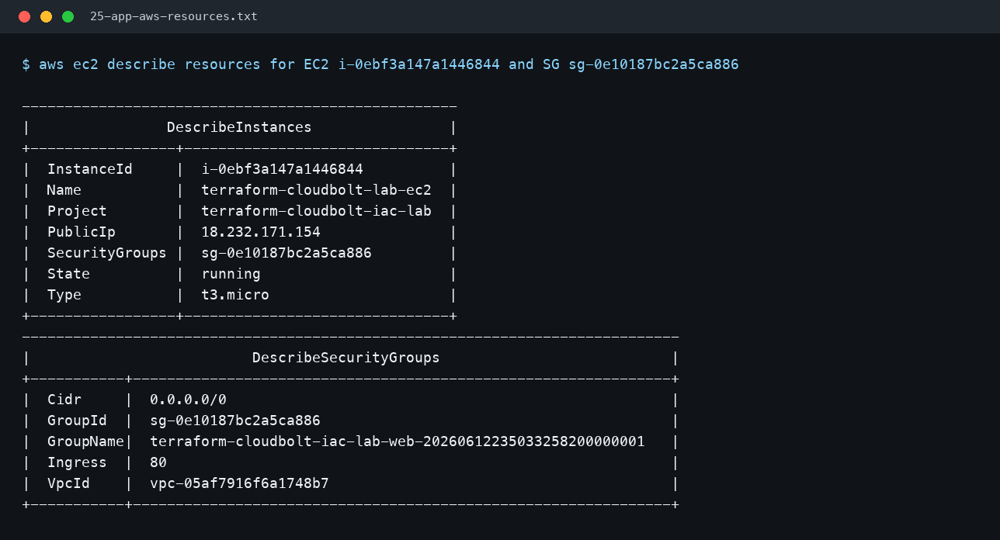

## Implantação da Aplicação

Para deixar o laboratório menos abstrato, publiquei uma aplicação real em vez de uma página escrita do zero. A escolhida foi a [TodoMVC em JavaScript puro](https://github.com/1Marc/modern-todomvc-vanillajs), porque é pequena, visual e não exige processo de empacotamento. A referência usada foi fixada em variável para manter reprodutibilidade:

```hcl
app_repo_url = "https://github.com/1Marc/modern-todomvc-vanillajs.git"
app_repo_ref = "58e4669bd959f1b8f8c63a8b2ab6f55173f6104d"
```

O novo plano passou a criar dois recursos: EC2 e Security Group.

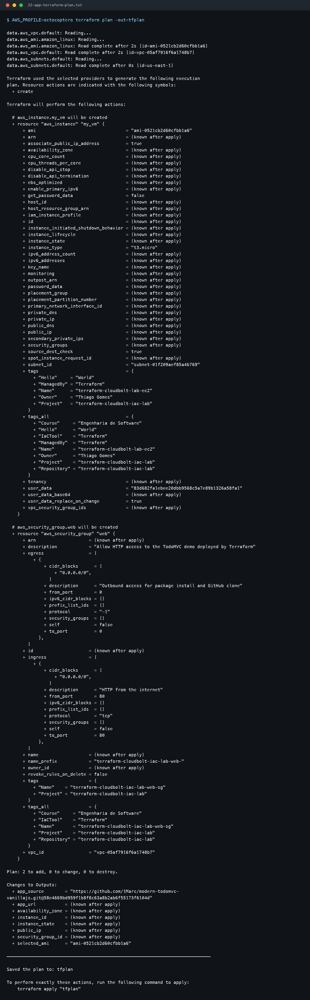

Após o `apply`, o Terraform retornou a URL pública da aplicação.

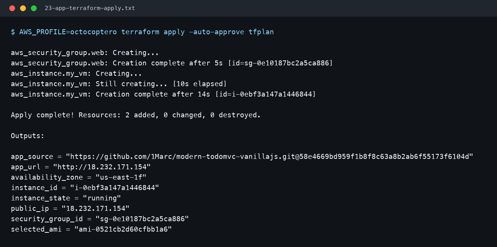

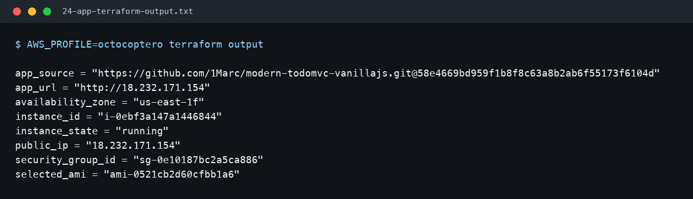

Validei primeiro por HTTP, confirmando que o HTML servido vinha da TodoMVC clonada do GitHub.

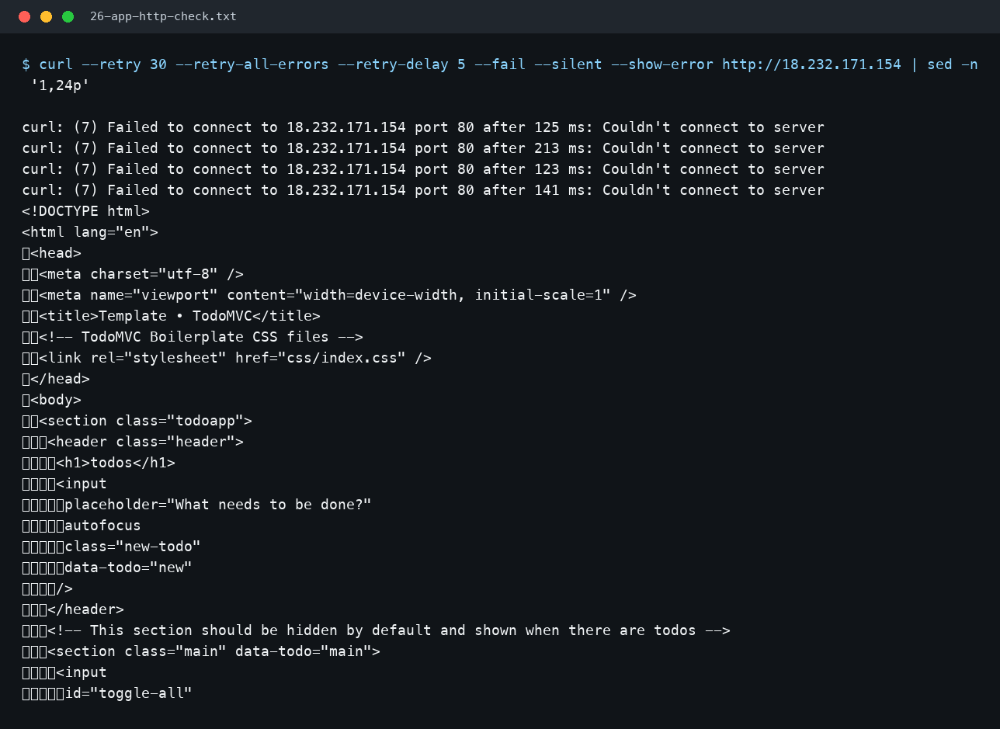

Depois fiz a conferência visual no navegador com Playwright, inclusive inserindo uma tarefa para provar que a interface carregou e executou JavaScript.

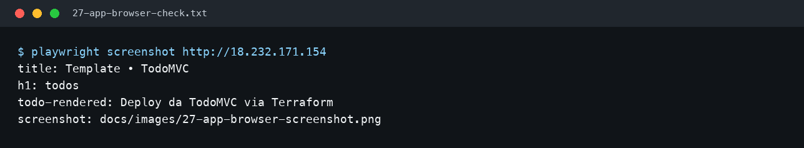

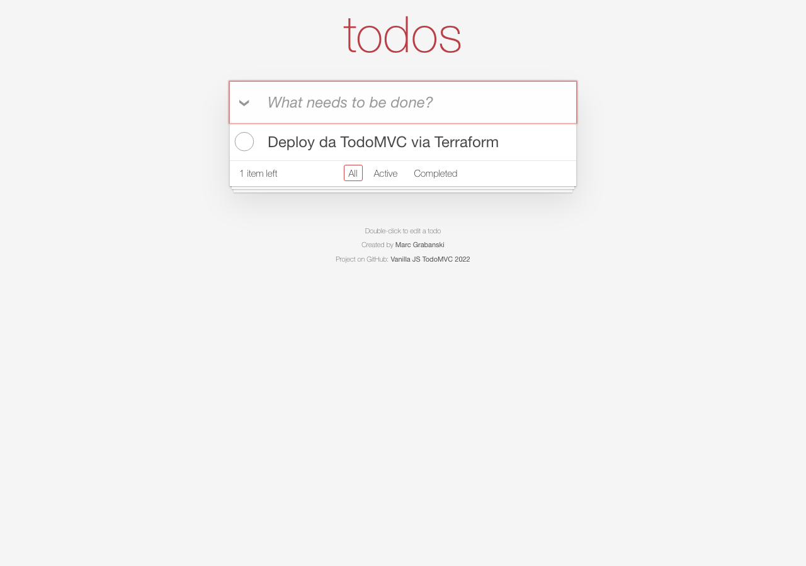

## Estado, Perda de Estado e Importação

Depois da criação, rodei um novo `terraform plan`. Como o estado ainda existia, o Terraform comparou código e nuvem e respondeu `No changes`.

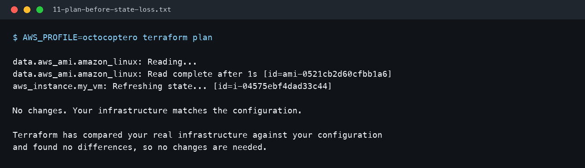

Em seguida, movi o estado local para simular perda ou corrupção de estado. Sem o `terraform.tfstate`, o Terraform não conseguia relacionar o código com a EC2 real e passou a sugerir a criação de outra instância.

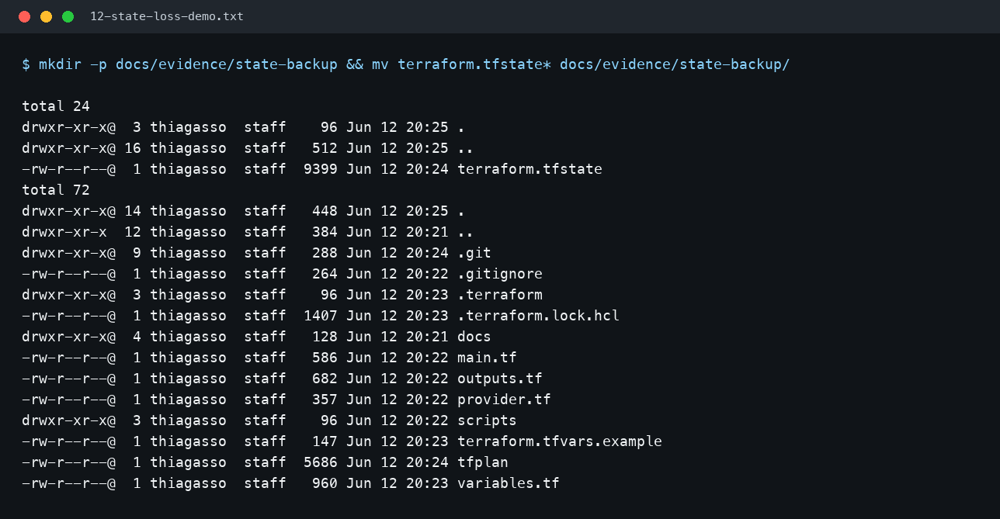

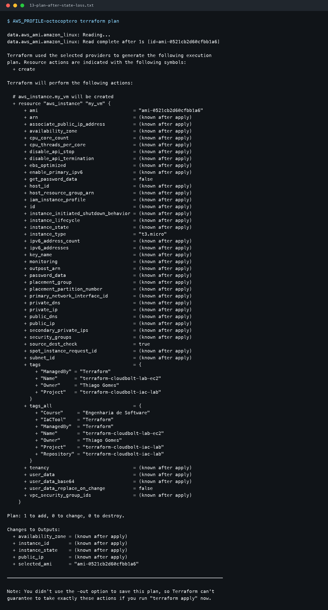

Para corrigir isso, usei `terraform import aws_instance.my_vm <instance-id>`. A importação recriou o vínculo entre o recurso real e o bloco HCL.

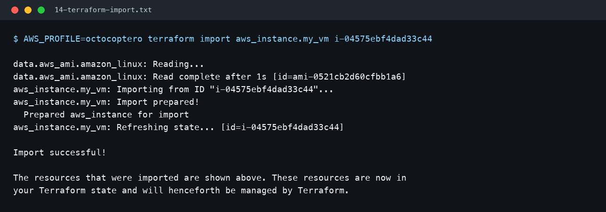

Depois da importação, o plano voltou para `No changes`, mostrando que o estado estava consistente novamente.


## Desvio de Configuração

Para demonstrar o drift, ou desvio entre configuração e ambiente real, adicionei a tag `Hello=World` fora do Terraform, simulando uma alteração manual feita no console da AWS.

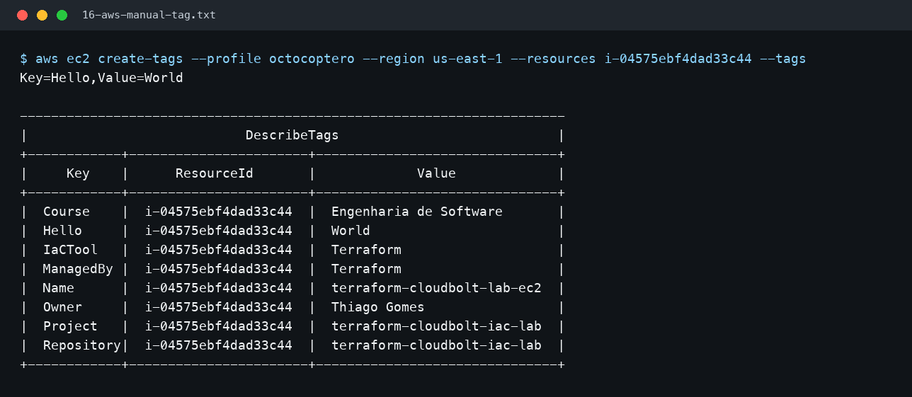

O próximo `terraform plan` detectou essa diferença e indicou que removeria a tag, porque ela ainda não estava no código.

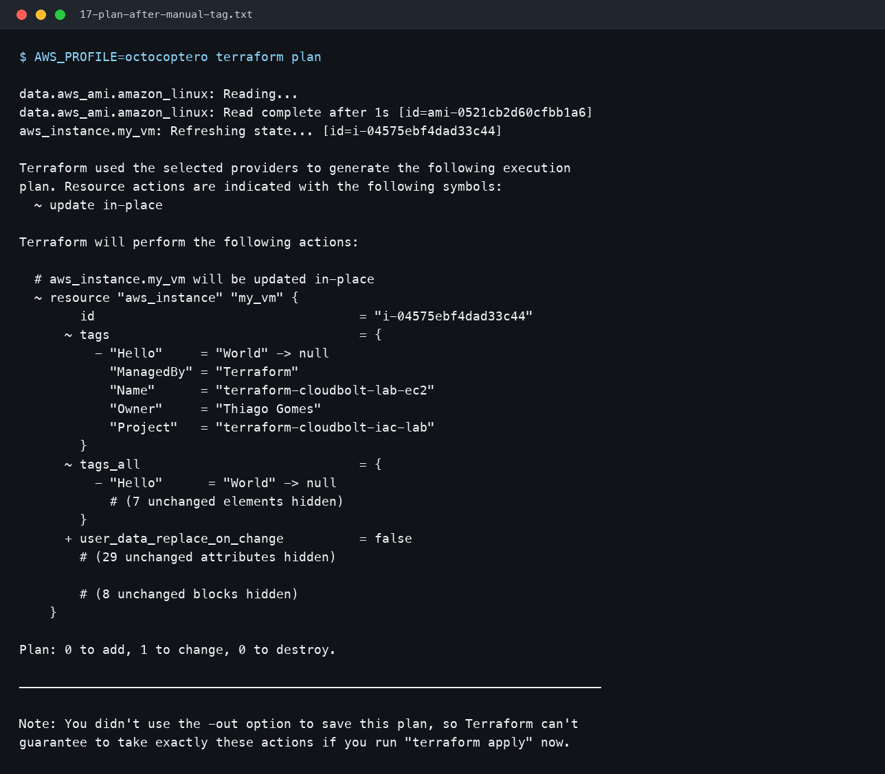

A correção foi trazer a mudança para o HCL, adicionando a tag `Hello = "World"` no `main.tf`. Com isso, o Terraform parou de enxergar drift.

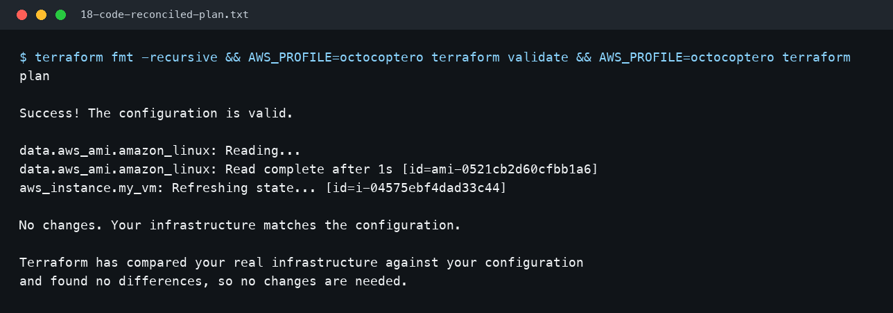

Evidência final das tags na AWS:

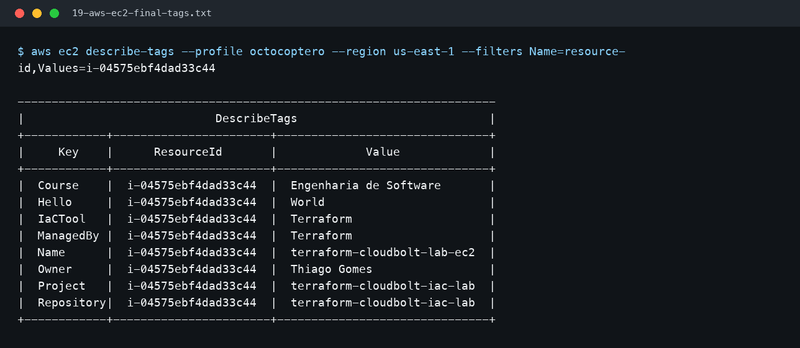

## Destruição do Ambiente

Como o objetivo era acadêmico e a evidência já estava registrada, finalizei com `terraform destroy` para evitar custo desnecessário.

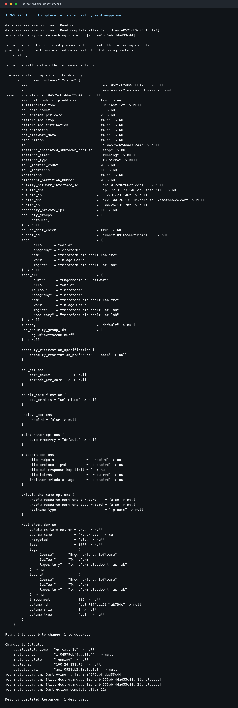

Confirmei em seguida que a instância ficou com estado `terminated`.

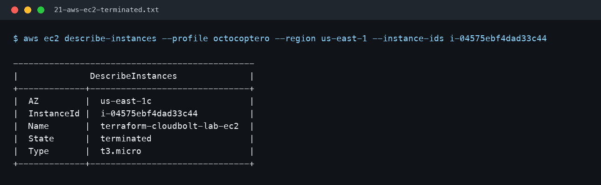

Depois da evolução com aplicação publicada, executei o `destroy` novamente. Dessa vez o Terraform removeu tanto a EC2 quanto o Security Group.

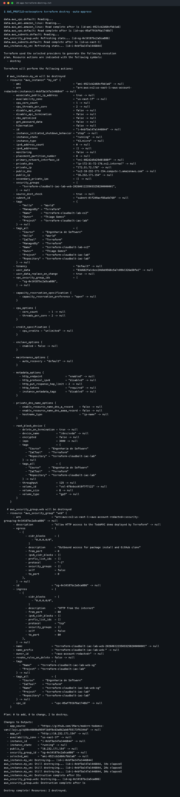

Na verificação final, a EC2 aparece como `terminated` e o Security Group já não existe mais.

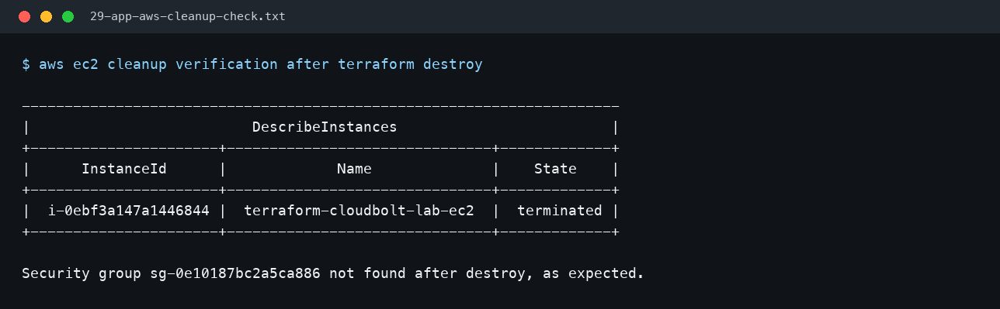

## Como Reproduzir

Com um perfil AWS configurado:

```bash
export AWS_PROFILE=octocoptero
terraform init
terraform fmt -check -recursive
terraform validate
terraform plan -out=tfplan
terraform apply tfplan
curl --retry 30 --retry-all-errors --retry-delay 5 "$(terraform output -raw app_url)"
terraform destroy
```

## O Que Aprendi

Terraform não só cria infraestrutura: ele guarda a relação entre o código e o recurso real no estado. Quando o estado some, o recurso ainda existe na AWS, mas o Terraform perde o mapa. O `import` resolve essa ligação, mas não escreve o HCL por nós. Por isso, a configuração precisa continuar representando fielmente o que deve existir na nuvem.

Publicar uma aplicação deixou esse ponto mais concreto: a EC2 deixou de ser só um recurso criado e passou a ser um ambiente funcional, com rede, inicialização automatizada e código externo versionado.
